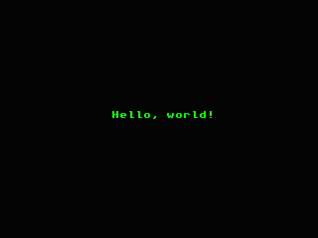
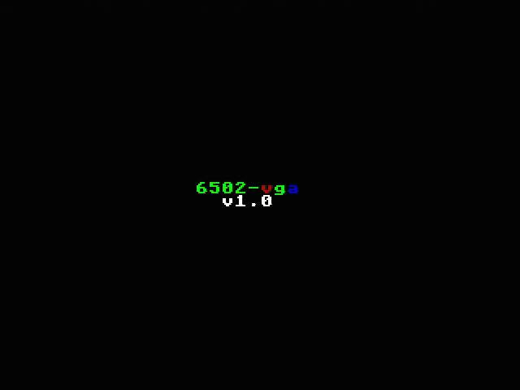

# 6502-vga-prop

This project realizes a VGA card, which can be connected to the expansion port of the [6502-cent1](https://github.com/rene6502/6502-cent1).

Features:
-	VGA Signal 640 x 480 @ 60 Hz Industry standard timing
-	Display resolution 320x240 pixels, 40x30 characters, 16 out of 64 colors
-	Single graphics mode using tiles and user-definable character set
-	Integrated funscii system font (2 colors)
-	256 user-defined characters (8x8 pixels, 16 colors) in addition to the system font
-	Memory interface to 6502 bus via 16K dual-port static video RAM (VRAM)
-	Support for double buffering
-	VGA driver extensible by Propeller assembly language

## Hardware

The video signal is generated by a Parallax Propeller 1 using 8 GPIO pins to create a 2-bit RGB, a vertical and a horizontal synch signal.  
The Propeller stores the program in an eeprom and can be programmed via the serial interface.  
Because the Propeller operates at 3.3V a regulator and level shifters are integrated.  
To overcome the limitation of Propeller GPIO pins a binary counter is used to generate the address to the VRAM.  
The 6502 interfaces directly with the VRAM. The 6502 will interact with the VGA via memory, like the old video chips of the 8-bit home-computers.  

## Examples

### Hello,World!
Source: [hello-world.asm](demo/hello-world.asm)  

### Demo 
Display colorized texts and demonstrates usage of the user-defined character set.  
Source: [vga_demo.asm](demo/vga_demo.asm)  

## Software
The software consists of the vga driver, which is written in Propeller assembly language.  
It makes use of the 320x240 [scanline driver](https://github.com/konimaru/waitvid.2048) from Marko Lukat which uses a single cog.  
6 renderer cogs are used to convert the tilemap into scanlines using the addressed character set.  
A separate vram driver cog is used to read the VRAM memory and copy it to the hub memory, where it can be accessed from the renderer cogs.  
The vram driver copies from VRAM to a separate copy buffer.  
The 6502 can control when and what part of this copy buffer will be transferred to the main hub memory, where it will be read from the renderer cogs (double buffering).  
This copy is done during the vertical blank so that the rendering will not be disturbed by changing the VRAM memory from the 6502.  
The 6502 can control when and what parts should be copied.

**Memory Map**
| area     | start | end  | description        |
| -------- | ----- | ---- | ------------------ |
| ctrl_cmd | 0200  | 0200 | command            |
| tilemap  | 0210  | 0B6F | screen tiles       |
| palettes | 0B70  | 0C6F | color palettes     |
| frame    | 0C70  | 0C71 | frame number       |
| charset  | 0C80  | 2C7F | user character set |

**ctrl_cmd**  
This register controls which memory will be transferred during the next vertical blank  
bit 0: copy control section  
bit 1: copy tilemap and palettes  
bit 2: copy user-defined character set

**tilemap**  
screen tiles with 40 columns and 30 rows, starting with first row  
each tile is 16 bit, LSB contains the character code and MSB the palette index  
if the bit 4 of the MSB is set to 1 then the user-defined character set is used, otherwise the system character set  

**palettes**  
Table of 16 palettes, each containing 16 colors  
Color is encoded as bit 6-7: R, bit 4-5: G, bit 2-3 B, bit 0-1 always 0  
The system characters use 2 colors, the user-defined characters use 16 colors  

**frame**  
16 bit frame counter, this value is incremented after the buffer was copied during the vertical blank

## Implementation details

### Tilemap and memory map

### Timing

## Schematics and PCB
- [PDF](doc/schematics.pdf) of schematics
- See the KiCad project in folder [kicad](./kicad)  

## Connecting vga board with 6502-cent1
The vga board is connected using a 32-pin ribbon IDC cable. The RAM from the mainboard must be removed.  
It is replaced by the 16k VRAM of the vga board using the address space $0000-$3FFF.  

## Connect serial to program Parallax Propeller
Initially the Propeller must be programmed with the VGA driver.
To do so a USB-Serial Adapter is required.  
It must provide a DTR signal, which is needed to start the Propeller boot-loading process.  
A working example is [FT232-AZ USB to TTL Serial Adapter for 3.3V and 5V](https://www.az-delivery.de/en/products/ftdi-adapter-ft232rl).  
The spin/assembly program can be compiled and loaded to the eeprom using the [SimpleIDE Software from Parallax](https://www.parallax.com/download/Propeller-1-software).  

Once loaded the vga will show a simple startup screen and is ready to display the tile map.

## Credits
-	Wuerfel21 for the [Funscii font](https://github.com/Wuerfel21/funscii)
-	Marko Lukat for the [scanline video driver](https://github.com/konimaru/waitvid.2048)
- Adam Saltsman for the ["1985" tileset](https://adamatomic.itch.io/1985)

